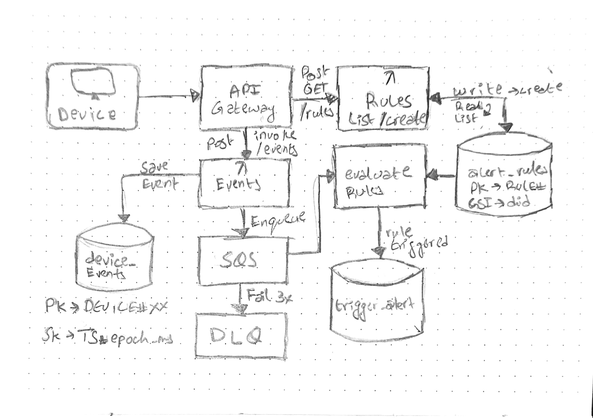

# AWS Cloud + Backend Assignment

A serverless backend for IoT device event ingestion with real-time alert rule evaluation.

**Stack:** Python 3.11 · Node.js 20 · AWS Lambda · API Gateway · DynamoDB · SQS

---

## Architecture



---

## Features

- **Event Ingestion** — REST API for device telemetry with validation and persistence
- **Alert Rules** — Configure threshold-based alerts per device and metric
- **Asynchronous Evaluation** — SQS-driven rule evaluation with automatic retries
- **Dead Letter Queue** — Failed messages routed to DLQ with CloudWatch alarms
- **Partial Batch Failures** — One bad message doesn't block others
- **GSI-optimized Queries** — Efficient device-specific lookups

---

## Prerequisites

- Node.js ≥ 20
- Python ≥ 3.11
- AWS CLI configured
- Serverless Framework: `npm install -g serverless`

---

## Deployment

### 1. Deploy Python Service (Events)

```bash
cd services/events
pip install -r requirements.txt
sls deploy --stage dev
```

### 2. Deploy Node Service (Rules)

```bash
cd services/rules
npm install
sls deploy --stage dev
```

**Note:** Python service must be deployed first — Node service imports the SQS queue ARN.

---

## API Endpoints

### Events Service (Python)

```bash
POST   /events                      # Ingest device event
GET    /devices/{device_id}/events  # Query events by device
```

### Rules Service (Node.js)

```bash
POST   /rules     # Create alert rule
GET    /rules     # List rules (?device_id=...)
GET    /alerts    # List triggered alerts (?device_id=...)
```

---

## Usage Example

```bash
# 1. Create a rule: alert when temperature > 60
curl -X POST   https://6rkdsuoao3.execute-api.ap-southeast-2.amazonaws.com/dev/rules \
  -H "Content-Type: application/json" \
  -d '{
    "device_id": "D1",
    "metric": "temperature",
    "operator": ">",
    "threshold": 60,
    "enabled": true
  }'

# 2. Send an event that triggers the alert
curl -X POST https://991y9p57v1.execute-api.ap-southeast-2.amazonaws.com/dev/events \
  -H "Content-Type: application/json" \
  -d '{
    "device_id": "D1",
    "type": "temperature",
    "value": 61.2,
    "ts": 1760000000000
  }'

# 3. Check triggered alerts (wait ~5 seconds for processing)
curl "https://6rkdsuoao3.execute-api.ap-southeast-2.amazonaws.com/dev/alerts?device_id=D1"

# 4. Query stored events
curl "https://991y9p57v1.execute-api.ap-southeast-2.amazonaws.com/dev/devices/D1/events
```

or use the postman collection

---

## Data Model

### device_events

```
PK: DEVICE#<device_id>
SK: TS#<epoch_ms>
Attributes: type, value, ts, ingested_at, request_id
```

### alert_rules

```
PK: RULE#<uuid>
GSI: device_id
Attributes: metric, operator, threshold, enabled, created_at
```

### triggered_alerts

```
PK: ALERT#<device_id>
SK: TS#<fired_at>#<alert_id>
GSI: device_id
Attributes: rule_id, metric, operator, threshold, actual_value, fired_at
TTL: 90 days
```

---

## Teardown

```bash
cd services/rules && sls remove --stage dev
cd services/events && sls remove --stage dev
```

---

## Key Design Decisions

- **Idempotency:** Events use `ConditionExpression` to prevent duplicates
- **Partial Batch Failures:** `ReportBatchItemFailures` ensures one bad message doesn't block others
- **GSI on device_id:** Enables efficient per-device rule/alert queries
- **Manual DLQ routing:** Poison messages sent directly to DLQ to avoid retry loops
- **Decimal storage:** Floats stored as `Decimal` to avoid DynamoDB precision issues

---

## Monitoring

- **CloudWatch Logs:** All Lambda executions logged with structured JSON
- **DLQ Alarm:** Fires when ≥1 message lands in dead letter queue
- **Metrics:** Track SQS queue depth, Lambda errors, DynamoDB throttles via CloudWatch

---

## License

MIT
